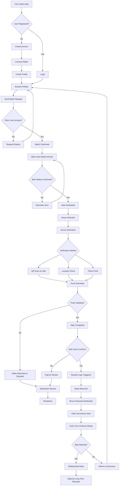

# StarkMatch

StarkMatch is a social discovery app where people don’t just match — they **actually meet**.

Traditional social and dating platforms optimize for swipes and conversations, but very few interactions lead to real-world meetings. StarkMatch solves this by introducing a **commitment-based meetup system** that rewards people who follow through.

The result is a platform where **reliability becomes reputation**, and real-world interactions are the core metric of trust.

---

# Concept

Most social platforms measure engagement through likes, swipes, and messages.

StarkMatch measures something more meaningful:

**real-world meetups.**

When two users match and schedule a meetup, both place a small commitment deposit. When they arrive and confirm the meetup through the app, the deposit is returned and both participants receive a reward.

Over time, users build a **Social Proof Score** that reflects how consistently they show up and complete meetups.

---

# Key Features

## Discover
Users browse profiles and swipe left or right.

Profiles display a **Social Proof Score**, which shows how reliable someone is based on completed meetups.

## Matches
Mutual likes create matches.

Users can chat and schedule meetups directly from the match screen.

## Meetup Scheduling
Users choose a venue, date, and time for their meetup.

Both participants place a small commitment deposit to confirm attendance.

## Check-In Verification
When the meetup happens, both users check in through the app.

If both confirm the meetup:
- deposits are returned
- rewards are distributed
- Social Proof Scores increase

## Social Proof Score
Each user builds a reputation score based on real interactions.

Example metrics include:
- verified meetups
- reliability
- ghost rate

This creates a **trust signal** for future matches.

---

# Business Model

StarkMatch creates value for three main participants.

## Users
Users earn rewards for completing meetups and build a reliable social reputation.

## Venues
Cafés and venues can run **meetup campaigns** that bring real customers to their locations.

Instead of paying for ads, they pay for **guaranteed visitors**.

Example:
A café runs a “Coffee Meetup Weekend” campaign and rewards users who meet there.

## Platform Revenue
StarkMatch generates revenue through:

- venue campaign sponsorships
- small service fees on verified meetups
- premium discovery features for users

---

# Technology

StarkMatch integrates **StarkZap** to power the wallet and payment layer inside the app.

StarkZap enables:
- simple user login
- balance management
- commitment deposits
- reward distribution
- seamless payments inside the app

This allows users to interact with the system without complicated setup.

---

# User Workflow

1. A user joins StarkMatch.
2. They browse profiles and swipe in Discover.
3. A mutual like creates a match.
4. The two users schedule a meetup.
5. Both place a commitment deposit.
6. They arrive at the venue and check in.
7. The system verifies the meetup.
8. Deposits are returned and rewards are issued.
9. Both users gain Social Proof Score.

---

# Vision

StarkMatch aims to transform social platforms from places where people only chat into places where people actually **connect in the real world**.

By rewarding real interactions and building reputation around reliability, StarkMatch creates a healthier and more meaningful way for people to meet.

---

# Tagline

**StarkMatch — rewarding people who actually show up.**
